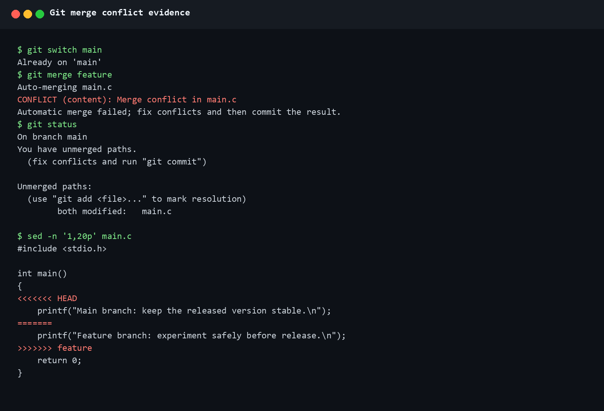
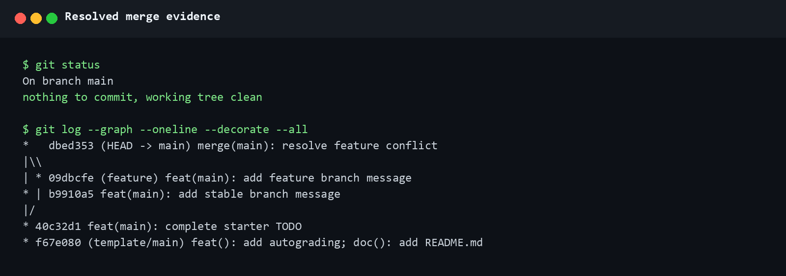

# Lab0：GitLab 实验报告

24300120172-倪苏旸
>
> GitHub：[`speedwal-spec/lab0-gitlab`](https://github.com/speedwal-spec/lab0-gitlab)

## 1. 实验目标

本实验的目标是熟悉 Git 的基本工作流、分支管理和 GitHub 远程仓库操作，并通过一次真实的分支合并冲突理解 Git 的协作模型。说得直白一点，就是先把 Git 的基本流程跑通，再亲眼看一次冲突到底长什么样，而不是每次看到红色提示就先怀疑电脑。完成的本地仓库位于 `lab0-gitlab`，最终代码和本报告均在 `main` 分支。

## 2. 文档问题回答

### 2.1 多人协同开发经历与分工

我个人确实有过正式的多人协同开发经历。2026 年春季学期，我在丁恒辉老师的《人工智能导论》（AIE310005.01）中与组员完成辽 PJ10“新闻标题自动生成”项目。我们基于 Seq2Seq/T5 实现了从数据准备、模型训练、ROUGE 评估到交互式推理的流程，项目仓库为 [`speedwal-spec/PJ10_S2S_`](https://github.com/speedwal-spec/PJ10_S2S_)。

不过，我们当时还没有真正掌握 Git 协作。具体任务主要通过组内沟通安排，前期成果则通过压缩包互相传递；后来虽然建立了 GitHub 仓库，但更多是把它当作共享暂存点，没有用 Issue、独立分支和合并请求记录每个人的职责与交付边界。现在回头看，当时的 GitHub 更像一个大型共享文件夹，大家都能往里面放东西，但不一定找得到最新的那一份。即使借助 AI 工具提高了局部编码效率，团队仍然遇到了重复实现、难以判断哪个版本应作为基线、不同版本生成的数据和缓存相互混入，以及不同成员修改 `.gitignore` 后相互干扰等问题。这段经历让我认识到，“所谓一起写完项目”不等于建立了可靠的协作过程。

就本次实验而言，我用 `main` 和 `feature` 两个分支重现了最基本的并行开发与冲突解决。如果重新组织 PJ10，我会先约定仓库结构和文件边界，再按数据处理、训练、评估和 Demo 等模块分工；每项任务从共同基线创建独立分支，用小而明确的提交来记录过程，并通过合并请求复核后再进入 `main`。数据集、缓存和模型 checkpoint 则不应由成员随意加入或忽略，而应统一规定存储位置，由下载脚本、配置和数据清单保证可复现。

### 2.2 为什么要有“暂存—提交”两个步骤

暂存区提供了一个明确的提交边界。工作区中可能同时存在多个目的不同的修改，例如一个功能实现、一个格式调整和一份文档更新。先用 `git add` 选择本次要提交的文件或修改，再用 `git commit` 固化版本，我个人认为可以带来以下好处：
1. 一次提交只表达一个相对完整的意图，历史更容易阅读和回退。
2. 可以在提交前检查暂存内容，避免把调试代码或无关文件一并提交，同时也减少误操作。
3. 可以把同一批工作区改动拆成多个逻辑提交，便于代码审查和定位问题。
4. 提交只记录已经确认的快照，而工作区仍然可以继续进行下一项工作。
因此，我把暂存区理解成“准备提交的内容”和“正在编辑的内容”之间的检查站：先在这里看一眼，至少能避免把还没调完的东西顺手打包带走。srds可能确实存在一定的不是多余的中转站的累赘、、

### 2.3 `git branch` 与 `git branch -a` 的区别

最直观的一点是，`git branch` 默认列出本地分支，例如当前仓库会显示 `main` 和 `feature`；带有 `*` 的分支是当前分支。
而 `git branch -a` 列出所有分支，包括本地分支和远程跟踪分支，例如 `remotes/template/main`。简单说，`-a` 就是把远程分支也叫出来一起点名。远程跟踪分支是本地对远程分支状态的记录，不等于当前工作区中的本地分支。查看远程分支前通常需要先执行 `git fetch` 或 `git pull` 获取最新信息。
实验中我在本仓库中实际观察到的区别是：前一个命令只显示 `main` 和 `feature`，后一个命令还会显示 `remotes/template/HEAD` 和 `remotes/template/main`。这让我意识到，本地分支、远程仓库和远程跟踪分支是三个相关但不同的概念。

这里我参考了：[Git 官方文档：git-branch](https://git-scm.com/docs/git-branch)

## 3. Git 基本操作与实验步骤

### 3.1 初始化与完成 TODO

我从课程模板仓库克隆了初始代码。第一次查看远程仓库时只有默认名称 `origin`；为了提醒自己这是只用于获取课程模板的上游仓库，我将它改名为 `template`，避免误把实验内容推回课程模板仓库。毕竟远程仓库名字看起来只是几个字母，手滑推错之后可就不是几个字母的问题了。

以下是当时在 bash 中的命令行日志：
```bash
git clone https://github.com/ICS-26Fall-FDU/GitLab.git lab0-gitlab
cd lab0-gitlab
git remote rename origin template
git status
git remote -v
```

初始 `main.c` 中的 TODO 是输出一句话。我将其改为：

```c
printf("Every commit tells a story.\n");
return 0;
```

修改后，我先用 `git diff` 确认只改动了目标文件，再完成第一次提交：

以下是当时在 bash 中的命令行日志：
```bash
git add main.c
git status
git commit -m "feat(main): complete starter TODO"
```

查询后，对应提交为 `cb6790f`。

### 3.2 创建 feature 分支并提交

以下是当时在 bash 中的命令行日志：
```bash
git switch -c feature
```

切换后我先运行 `git branch`，确认 `*` 已经出现在 `feature` 前。我把这个分支理解成实验草稿纸，先在这里试错，至少不会立刻把 `main` 一起带进坑里。随后在 `feature` 分支中，将输出行改为：

```c
printf("Feature branch: experiment safely before release.\n");
```

然后提交：

```bash
git add main.c
git commit -m "feat(main): add feature branch message"
```

此时的对应提交为 `a3f4b4b`。

### 3.3 在 main 分支进行冲突性修改

切回 `main`，并再次用 `git status` 确认当前分支：

```bash
git switch main
git status
```

为了让冲突有机会登场，我在 `main` 分支中把同一行改成了另一种内容：

```c
printf("Main branch: keep the released version stable.\n");
```

然后提交：

```bash
git add main.c
git commit -m "feat(main): add stable branch message"
```

对应提交为 `2a4e09d`。由于两个分支都从同一个父提交出发，并且修改了 `main.c` 的同一行，接下来合并时会产生冲突。

### 3.4 合并并解决冲突

在 `main` 分支执行：

```bash
git merge feature
```

Git 很直接地报告：

```text
CONFLICT (content): Merge conflict in main.c
Automatic merge failed; fix conflicts and then commit the result.
```

此时 `main.c` 中出现了 `<<<<<<< HEAD`、`=======` 和 `>>>>>>> feature` 三个冲突标记。为在不改动主工作区的情况下再次核验，我从 `main` 侧的冲突前提交建立临时 worktree，并合并 `feature` 侧提交：

```powershell
git worktree add E:\lab0-proof 2a4e09d
git -C E:\lab0-proof merge a3f4b4b
```

值得一提的是，合并再次产生相同的内容冲突。Git 这次没有替我们猜，而是把两边的版本都摆出来让我们自己做决定。如下是案发现场的 Windows PowerShell 截图，其中包含 `git status` 输出和 `main.c` 中的冲突标记：



我还根据两边的意图，保留“feature 工作最终进入稳定 main 分支”的合并语义，将冲突区域改为：

```c
printf("Feature work is merged into the stable main branch.\n");
```

解决后，我在终端输入并执行：

```bash
git add main.c
git commit -m "merge(main): resolve feature conflict"
```

生成的合并提交为 `1e472cb`。我随后检查工作树，确认它已经干净：

```text
On branch main
nothing to commit, working tree clean
```

并且提交图同时保留了 `main` 和 `feature` 两条历史。下面是主仓库处于干净状态时运行 `git status` 和 `git log --graph --oneline --decorate --all` 后得到的真实 Windows PowerShell 截图。我们从中既能看到 `nothing to commit, working tree clean`，也能看到双父合并提交以及 `main`、`feature` 两条历史重新汇合：



从提交图中的分叉、两个父提交和重新汇合可以确认，这不是一次 fast-forward 合并。前面的冲突复现截图完成后，我执行 `git merge --abort` 并移除了临时 worktree；主仓库的代码和提交历史没有被复现操作改动。【终于成功了hhhh】

### 3.5 连接个人 GitHub 仓库

我一开始先在本地完成了实验，之后才在 GitHub 上从课程模板创建个人仓库。这个顺序现在看确实有点绕，也与文档推荐的“先创建个人仓库、再克隆”不同，因此本地和 GitHub 当时各有一个内容相同、但提交编号不同的模板起点。

我先用 `git bundle` 保存完整本地历史作为备份，再添加个人仓库远程：

```bash
git remote add origin https://github.com/speedwal-spec/lab0-gitlab.git
git fetch origin
```

确认两个起点的文件树完全一致后，苯人把实验提交重放到个人仓库的初始提交之上，并保留合并结构：

```bash
git rebase --rebase-merges --onto origin/main f67e080 main
```

重放到合并提交时，同一处冲突再次出现。我使用原合并提交中已经确认的最终内容解决冲突，再运行 `git rebase --continue`。最后通过提交图确认 `feature`、`main` 和双父合并提交仍然完整，然后推送两个分支：

```bash
git push -u origin main
git push -u origin feature
```

这次补救给我的教训是：就算工作区文件相同，也不代表两条 Git 历史自动相同；下次应先从模板创建个人仓库，再克隆个人仓库开始实验。`rebase` 有点像给旧历史搬家，会改写提交编号，所以日常协作中不能在未沟通的情况下对共享历史执行这类操作。

## 4. 拓展阅读之读后感

### 4.1《Commit message 和 Change log 编写指南》

该文章指出，commit message 应该应该应该（！）清晰地说明本次提交的目的。推荐的 Angular 风格把提交说明分成 Header、Body 和 Footer：Header 使用 `<type>(<scope>): <subject>`，Body 解释修改动机以及与旧行为的差异，Footer 用于记录不兼容变更或关闭 Issue。常见的 `type` 包括 `feat`、`fix`、`docs`、`style`、`refactor`、`test` 和 `chore`；标题应简洁、以动词开头，并避免无意义的句号。

而规范化提交信息的价值在于，可以快速浏览历史、按类型筛选提交、自动生成 Change Log，并让代码审查者理解一个提交为什么存在。读完之后我再看 PJ10 的历史，才发现本实验使用的 `feat(...)` 和 `merge(...)` 风格并不只是好看，也是在练习让历史记录具有可读性。

这篇文章让我重新看待过去经验中PJ10 中类似 `debug`、`experimental` （实际表述五花八门，包括但不限于一些全拼表述呃呃）的提交说明：它们记录了“做过一次修改”，却没有说明修改的是数据预处理、训练参数还是评估逻辑，也无法提示是否会影响数据、checkpoint 或实验结果。如果把一次预处理修复、一次模型参数调整和一次界面改动分别提交，并在说明中写清动机与影响范围，组员就能更容易定位基线、比较实验和撤销问题修改。对我而言，好的 commit message 不是形式上的整齐，而是团队共享的实验记录。

参考来源：[Commit message 和 Change log 编写指南](https://www.ruanyifeng.com/blog/2016/01/commit_message_change_log.html)

### 4.2《Gitflow 使用规范》

这篇好不容易读下来的文章介绍了以长期分支和短期分支配合发布的 Gitflow 工作流。`master`（本课程使用 `main`）保存稳定的线上版本，`develop` 用于日常集成；新功能从 `develop` 创建 `feature` 分支，完成后合并回 `develop`；准备发布时创建 `release` 分支，测试完成后合并到稳定分支并打版本标签；线上紧急问题则从稳定分支创建 `hotfix` 分支，修复后合并回稳定分支和开发分支。

这种模型用分支职责隔离降低协作风险，并通过 `--no-ff` 等策略保留功能或发布分支的边界。我想它不一定适合所有项目，但至少展示了“从正确的基线创建分支，完成后回到原来的集成线”的重要思想。（？）

完整 Gitflow 对 PJ10 这样周期有限的课程项目可能过重，但它揭示的问题与我们的经历直接相关。如果我们没有稳定基线和明确的集成入口，压缩包、临时代码和不同版本的 `.gitignore` 很容易一起进入共享版本。更合适的做法是采用轻量工作流：保持 `main` 可运行，每项任务使用短期 feature 分支，合并前同步最新基线、运行训练或评估所需的检查，并由至少一名组员确认改动。这样既保留分支隔离的价值，又不会为小组作业引入过多流程。

来源：[Gitflow 使用规范](https://www.dafaycoding.com/article/git-gif-flow) （PS：读下来还挺有成就感）

### 4.3 为什么要学习 Git

回首往昔，过去我主要把 GitHub 理解为“把代码放到网上”，PJ10 的协作问题说明，仅有远程仓库并不能自动产生版本管理。Git 真正解决的是变化如何被选择、说明、隔离和整合：暂存区确定一次提交的边界，commit 保存可追踪的实验步骤，分支让成员在不破坏稳定版本的前提下并行工作，merge 则把不同工作显式地汇合并要求解决冲突。

因此，现在学习 Git 对我来说可不只是为了在代码改坏后能够回退，更是为了回答团队开发中的几个关键问题，即当前可信的基线是什么，某项改动由谁、为什么引入，数据和生成文件是否应进入版本库，以及不同成员的成果如何经过检查后合并。AI 工具可以帮助生成或修改代码，但不能替团队决定这些协作规则；如果缺少清晰的历史和边界，编码速度越快，重复实现和版本混乱反而可能积累得越快。本次实验让我第一次把分支、冲突和合并提交看成一套协作机制，而不只是需要记住的命令。

## 5. 提交清单

- `main.c` 已完成模板中的 TODO，并已提交。
- 已创建 `feature` 分支，并在 `feature` 与 `main` 上分别提交了对 `main.c` 同一行的不同修改。
- `git merge feature` 已产生真实内容冲突，冲突标记已清理并形成 merge commit。
- `main` 分支最终工作树干净，提交图保留了合并前的两条分支历史。
- 已将实验报告写入 `main` 分支。
- 已用 MinGW GCC 13.2.0 和 GNU Make 4.4.1 实际完成清理、编译、运行和再次清理，程序正常输出最终合并内容，且没有产生编译警告。工具版本和完整输出见[编译运行记录](assets/build-verification.txt)。
- 已运行 `git diff --check template/main..HEAD -- .`、`git fsck --full` 和自动评分等价检查；文本格式、Git 对象和预期输出均符合要求，实际源码中已经没有冲突标记。
- GitHub Actions 自动评分已经通过，但该工作流只检查编译、运行以及输出是否不同于模板，不能代替对报告、分支结构和冲突处理过程的人工核验。

课程模板远程保留为 `template`，个人仓库 [`speedwal-spec/lab0-gitlab`](https://github.com/speedwal-spec/lab0-gitlab) 使用 `origin`。两者分开后，可以在需要时获取模板更新，同时避免向课程模板误推送，至少不用靠记忆力赌自己这次推到哪里。

## 6. 写在最后的思考

结合本次实验和 PJ10 的教训，我会在后续实验中坚持几项具体做法。首先，操作前先用 `git status` 确认分支和工作区；其次，每个提交只完成一个清晰目标，并在提交前检查暂存内容；再次，新任务从稳定基线创建 feature 分支，通过检查或复核后再合并；最后，推送前用 `git log --graph --oneline --all` 检查历史。对于包含数据和模型的项目，还应在协作开始时共同确定 `.gitignore`，明确源码、配置和数据清单需要跟踪，而原始数据、缓存、checkpoint 与临时输出采用统一的外部存储或可复现生成方式，避免每位成员各自修改忽略规则。相比事后在多个压缩包中进行“最终版考古”，这些约定成本很低，却能显著减少重复工作和版本污染。
